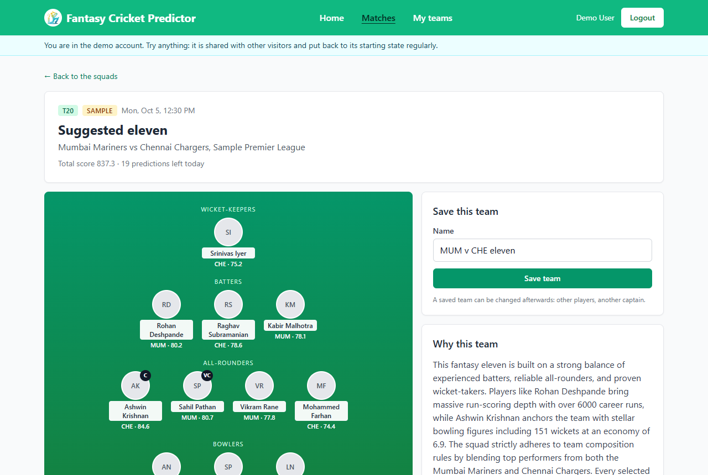
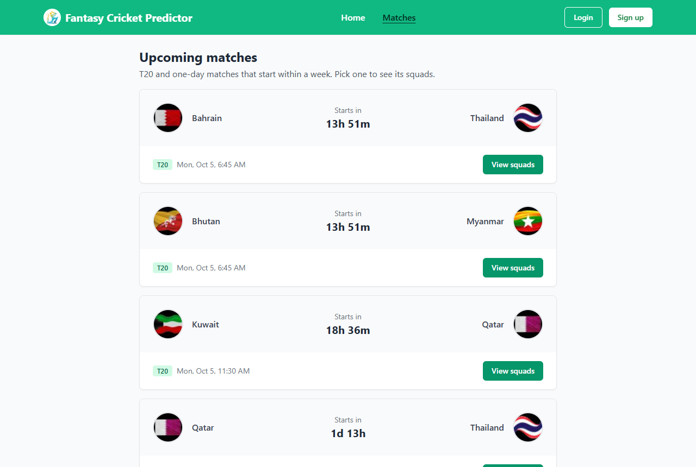
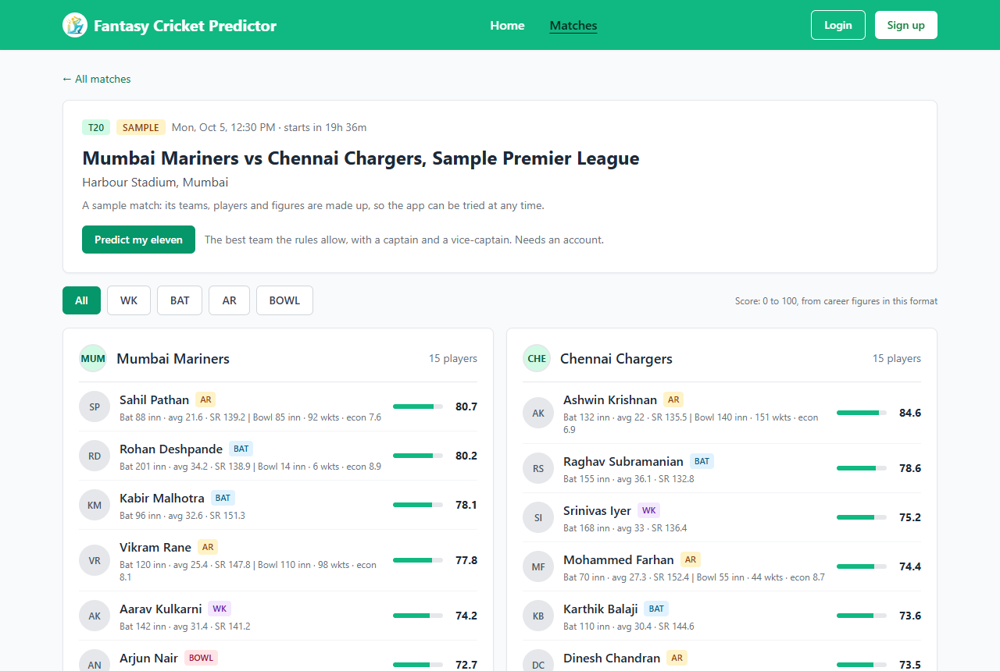
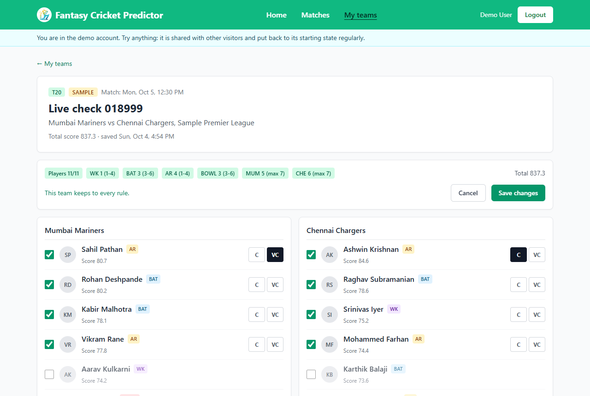
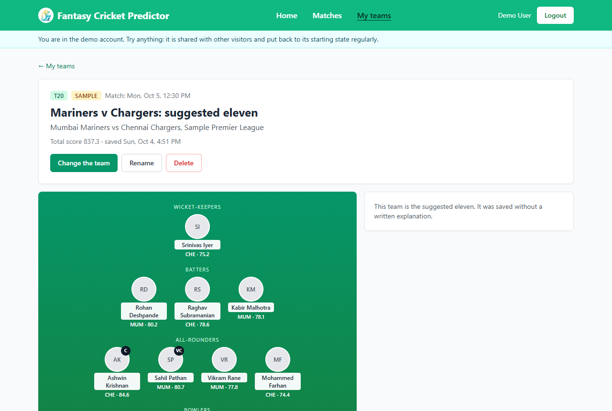
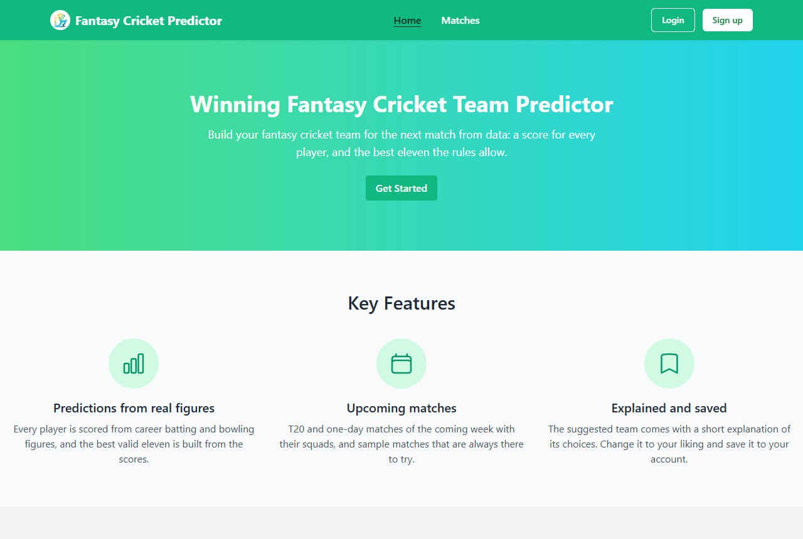

# Fantasy Cricket Predictor

Pick an upcoming T20 or one-day match and get a suggested fantasy eleven: a
score for every player, the best team the rules allow with a captain and a
vice-captain, and a short explanation of the choice. Change the team to your
liking and save it.

**Live demo:** <https://fantasy-cricket-predictor.vercel.app> — use "Try the
demo account" on the login page. The first request after a quiet spell can
take up to a minute, while the server wakes up.

We started it as a personal project in January 2025 and completed it
afterwards. [docs/design.md](docs/design.md) describes the design.

## Screenshots

| | |
|---|---|
|  |  |
|  |  |
|  |  |

## What it does

- **Matches and squads**: the T20 and one-day matches of the coming week from
  [cricketdata.org](https://cricketdata.org), with both squads and every
  player's career figures. Three sample matches with made-up teams are always
  there, so the app can be tried at any time, with or without a key.
- **A score for every player**: from 0 to 100, worked out from career batting
  and bowling figures in the format of the match. Nothing is estimated or
  made up: a player the source has no figures of is marked as such.
- **The best valid eleven**: 11 players with 1 to 4 wicket-keepers, 3 to 6
  batters, 1 to 4 all-rounders and 3 to 6 bowlers, at most 7 from one side.
  The server finds the team with the highest sum of scores exactly, not by
  trial, so the same squads always give the same team.
- **An explanation**: Gemini describes why the team looks the way it does. It
  is given the team and cannot change it; what it writes is checked before it
  is shown.
- **Saved teams**: save a team, rename it, swap players, choose another
  captain. The server checks every rule again and says which one is broken.
- **Accounts**: email sign-up with a verification link, password reset, and a
  demo account.

## How a player is scored

```
batting = (60 × min(average / A, 1) + 40 × min(strikeRate / S, 1)) × min(innings / 10, 1)
bowling = (60 × min(wicketsPerInnings / W, 1) + 40 × economyPart) × min(innings / 10, 1)
```

`economyPart` goes from 1 at the best economy to 0 at the worst.

| Format | A | S | W | Best economy | Worst economy |
|---|---|---|---|---|---|
| T20 | 40 | 160 | 1.5 | 6 | 10 |
| ODI | 50 | 100 | 1.8 | 4 | 7 |

A wicket-keeper or batter scores `0.9 × batting + 0.1 × bowling`, a bowler
`0.15 × batting + 0.85 × bowling`, an all-rounder `0.6 × batting + 0.6 ×
bowling` (at most 100). A player without figures scores 35.

## Living within a free plan

The free plan of the cricket source allows 100 requests a day. The squads of
a match cost 10 of them, and every player's figures are a request of their
own. So:

- Only the server talks to the source; the key never reaches the browser.
- Everything is kept in the database: the list of matches for an hour, squads
  for a day, a player's figures for fourteen days. Squads are asked for only
  from three days before a match, when they are likely to be announced.
- The server stops at 90 requests a day, and follows the source's own count
  when that is higher. The last 15 are kept from figures and
  the last 5 from squads, so the list of matches can always be fetched.
- When the source fails or the day's requests are used up, what was kept is
  shown, and the page says so. Many visitors opening the same match cause one
  request for each thing.
- An explanation is kept for six hours for each team of a match. A user can
  ask for 20 predictions a day, and the whole site has at most 200
  explanations written a day. When there is no text, the team is shown
  without it, and it is not asked for again for five minutes.

## Demo account

The login page has a "Try the demo account" button. The demo account has a
saved team for each sample match.

It is open to everyone, so it is fenced in: it sends no email, cannot change
its password, holds fewer teams than a real account, and every visitor has
their own allowance of predictions. With `SEED_ON_START=true` it is rebuilt
every time the server starts, which undoes whatever visitors did. Real
accounts are not touched.

## Tech stack

| Part | Stack |
|---|---|
| Web app | React 18, Vite, Tailwind CSS, Redux Toolkit |
| Server | Node.js, Express, MongoDB with Mongoose, JSON Web Tokens, Nodemailer, Gemini API |
| Tests | Jest, Supertest, in-memory MongoDB |

## Getting started

### Prerequisites

- Node.js 20 or newer
- A MongoDB connection string (local MongoDB or MongoDB Atlas)
- SMTP credentials or a Brevo API key, for the verification and reset emails
- Optional: a key from [cricketdata.org](https://cricketdata.org) for live
  matches, and a Gemini API key for the explanations

### Setup

```bash
cd server
npm install
cp .env.example .env     # then fill in the values, see below

cd ../client
npm install
```

### Settings

`server/.env`:

| Key | Purpose |
|---|---|
| `MONGODB_URI` | Database connection string |
| `PORT`, `SERVER_HOST` | Where the server listens (`3005`, `localhost`). On a host, `SERVER_HOST` is `0.0.0.0` and the host sets `PORT` |
| `FRONTEND_URL` | The address of the web app (`http://localhost:5179`). Links in emails point there |
| `ACCESS_TOKEN_SECRET` | A long random text; logins are signed with it. A login lasts 7 days |
| `NODE_ENV` | `production` on a host: the login cookie is then sent over https only |
| `CRICKET_API_KEY` | Optional. Without it the app shows its sample matches only |
| `CRICKET_DAILY_BUDGET` | Optional. Requests to the cricket source in a day, default `90` |
| `GEMINI_API_KEY`, `GEMINI_MODEL` | Optional. Without a key teams come without an explanation |
| `MAIL_HOST`, `EMAIL_PORT`, `MAIL_USER`, `MAIL_PASS` | SMTP settings |
| `BREVO_API_KEY`, `MAIL_FROM` | Optional. Send email through the Brevo HTTPS API instead of SMTP |
| `SEED_ON_START` | `true` rebuilds the demo account every time the server starts |
| `DAILY_PREDICTION_LIMIT`, `SITE_EXPLANATION_LIMIT` | Optional. Predictions a user may ask for in a day (`20`), explanations the whole site may ask for in a day (`200`) |
| `DEMO_CONNECTION_PREDICTION_LIMIT` | Optional. Predictions all visitors of the demo account behind one real address may ask for in a day, default `300` |
| `MAX_TEAMS`, `MAX_DEMO_TEAMS` | Optional. Teams an account may hold, default `50`; the demo account `20` |
| `DAILY_MAIL_LIMIT` | Optional. Mails the whole site may send in a day, default `250` |
| `CONNECTION_IP_HEADER` | Optional. A header in which the host reports the caller's address and which a caller cannot set, for example `cf-connecting-ip` on Render |

The request limits have defaults that suit a small site. Each can be changed
with a setting of its own: `ACCOUNT_RATE_LIMIT`,
`ACCOUNT_CONNECTION_RATE_LIMIT`, `ACCOUNT_GUESS_RATE_LIMIT`,
`ACCOUNT_EMAIL_RATE_LIMIT`, `ACCOUNT_MAIL_RATE_LIMIT`, `RESEND_RATE_LIMIT`,
`WRITE_RATE_LIMIT`, `WRITE_CONNECTION_RATE_LIMIT`, `PUBLIC_RATE_LIMIT` and
`PUBLIC_CONNECTION_RATE_LIMIT`.
`CORS_ORIGIN` names another origin that may call the server from a browser;
the web app itself needs none.

The web app needs no settings.

### Run

Start the server and the web app in two terminals:

```bash
cd server
npm run dev
```

```bash
cd client
npm run dev
```

Open <http://localhost:5179>. The web app forwards `/api` to the server on
port 3005.

### Tests

```bash
cd server
npm test
```

The tests start their own in-memory database. They never call the cricket
source or Gemini and never send email. The eleven is checked against every
possible team on small squads.

## How it is kept safe

- A user reaches only their own teams; another user's id answers "not found".
- Only ids are taken from a request to save a team. Names, roles and scores
  are the server's own, and the rules are checked on the server.
- What the cricket source answers is checked value by value before it is
  kept or shown. A match id a visitor made up is never sent to the source.
- Names from the source reach Gemini as data, not as instructions. Its answer
  must have a fixed shape; players it names must be among those left out; web
  addresses are taken out; and it never decides who is in the team.
- Logins, sign-ups, password resets and verification links are limited per
  visitor, per account and per address the request really came from; wrong
  passwords from one place do not lock the owner out elsewhere.

## Deployment

The server and the web app are deployed separately.

- **Server**: any Node.js host. Set the settings above, with
  `SERVER_HOST=0.0.0.0`, `NODE_ENV=production`, `FRONTEND_URL` pointing at
  the web app and `SEED_ON_START=true` for a public demo. The start command
  is `npm start` in `server`. On hosts that block SMTP ports, use
  `BREVO_API_KEY`. On Render, also set
  `CONNECTION_IP_HEADER=cf-connecting-ip`.
- **Web app**: a static build of `client` (`npm run build`).
  `client/vercel.json` forwards `/api` to the server, so the login cookie
  stays on the web app's own address; put the server's address there.

## API

Every route is under `/api/v1` and answers
`{ statusCode, data, message, success }`. The login is kept in an httpOnly
cookie.

| Route | Who | Purpose |
|---|---|---|
| `GET /health` | everyone | The server is up |
| `POST /users/register`, `POST /users/login`, `POST /users/demo-login` | everyone | Accounts |
| `POST /users/forgot-password`, `GET /verify/verify-email`, `GET /verify/reset-password`, `POST /verify/reset-password` | everyone | Verification and password reset |
| `GET /users/me`, `POST /users/logout`, `POST /users/resend-verification`, `POST /users/change-password` | logged in | The session |
| `GET /matches` | everyone | Upcoming matches, and where the list is from |
| `GET /matches/:id` | everyone | The match with its squads and every player's score |
| `POST /matches/:id/prediction` | verified | The suggested eleven with its explanation |
| `GET /teams`, `POST /teams` | logged in | Saved teams; save one (`matchId`, `name`, `playerIds`, `captainId`, `viceCaptainId`) |
| `GET /teams/:id`, `PUT /teams/:id`, `DELETE /teams/:id` | logged in | One saved team |

Predicting and saving need a verified email address.

## Project structure

```
server/
  src/
    app.js, index.js    Express app and start-up
    controllers/        Accounts, matches and predictions, saved teams
    cricket/            The source, the cache, the daily budget, sample matches
    prediction/         Scores, the eleven, the explanation
    middlewares/        Login, request limits
    models/             User, Team, Cache, Usage
    routes/
    scripts/            The demo account's data
    utils/
  tests/
client/
  src/
    api/                Requests to the server
    components/         The pitch, the team editor, session guards, shared pieces
    lib/                Rules, formatting, messages
    pages/              Landing, accounts, matches, prediction, saved teams
    redux/              Login state and on-screen messages
docs/
  design.md             Design of the app
```

## Team

Built by Samir Suroshe
([@samirsuroshe18](https://github.com/samirsuroshe18)), Tanishq Kulkarni
([@tanishqbuilds](https://github.com/tanishqbuilds)), Mohit Dhangar
([@mohit45v](https://github.com/mohit45v)) and Pranay Sanap
([@pranaysanap](https://github.com/pranaysanap)).
